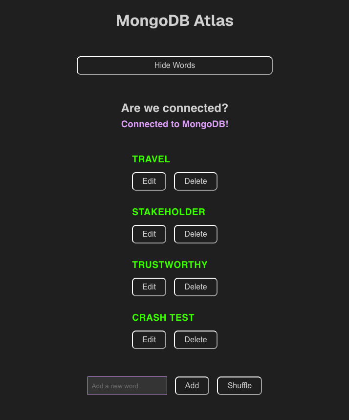

### School project
This is the follow up project's from M5G2 repo project. No emphasis was put on design, only on function. 

This project is a simple full-stack web application built with Next.js and MongoDB Atlas. It demonstrates how to connect a Next.js app to a remote MongoDB database and perform all basic CRUD (Create, Read, Update, Delete) operations through a JSON API.
Main features include:
- Fetching and displaying words from the database
- Adding new words (POST)
- Editing existing words (PUT)
- Deleting words (DELETE)
- Randomizing the displayed words with a shuffle feature.

I'm using both server and client components, showing how to combine them for an interactive, data-driven page. The API layer is kept simple and contained in a single file for clarity, but can be expanded as needed.

Styling is minimal and functional, focusing on demonstrating core concepts rather than design.



I followed guidelines from my [sensei's second tutorial](https://ellertsmarik.medium.com/json-api-using-next-js-13-and-mongodb-f45e8e61b031) (Hæ Smári!) 

This project is intended as a learning exercise in:
- Using HTTP methods and JSON APIs
- Understanding the difference between client-side and server-side code in Next.js
- Integrating MongoDB with a modern web framework
- Managing state and interactivity with React hooks


---

Backstory for this project:
Originally I deviated a little bit from the first tutorial and added to it some things that were needed for what I wanted to display. I've f.ex. added hooks to manage component state and I'm using effect hooks for fetching data from my API. Also incorporated f.ex. arrays, props, event handling, async functions and more. 

I´ve included the client and server side logs that were a part of that tutorial. 

On the landing page I've included a link to Smári's tutorial and a link wher you can learn MongoDB

-----

### In other news
This is a [Next.js](https://nextjs.org) project bootstrapped with [`create-next-app`](https://nextjs.org/docs/app/api-reference/cli/create-next-app).

## Getting Started

First, run the development server:

```bash
npm run dev
# or
yarn dev
# or
pnpm dev
# or
bun dev
```

Open [http://localhost:3000](http://localhost:3000) with your browser to see the result.

You can start editing the page by modifying `app/page.tsx`. The page auto-updates as you edit the file.

This project uses [`next/font`](https://nextjs.org/docs/app/building-your-application/optimizing/fonts) to automatically optimize and load [Geist](https://vercel.com/font), a new font family for Vercel.

## Learn More

To learn more about Next.js, take a look at the following resources:

- [Next.js Documentation](https://nextjs.org/docs) - learn about Next.js features and API.
- [Learn Next.js](https://nextjs.org/learn) - an interactive Next.js tutorial.

You can check out [the Next.js GitHub repository](https://github.com/vercel/next.js) - your feedback and contributions are welcome!

## Deploy on Vercel

The easiest way to deploy your Next.js app is to use the [Vercel Platform](https://vercel.com/new?utm_medium=default-template&filter=next.js&utm_source=create-next-app&utm_campaign=create-next-app-readme) from the creators of Next.js.

Check out our [Next.js deployment documentation](https://nextjs.org/docs/app/building-your-application/deploying) for more details.
